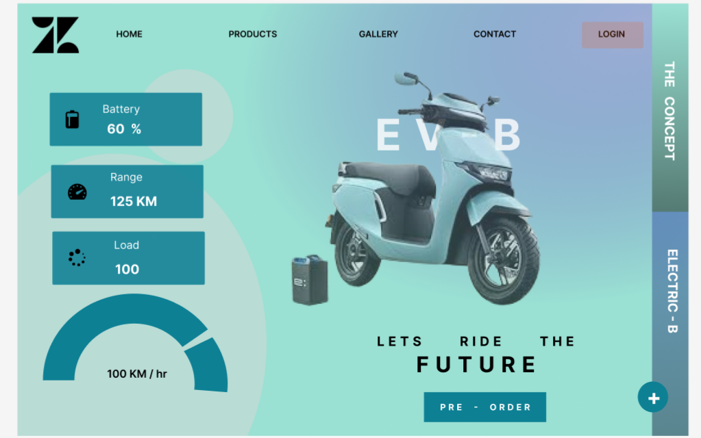
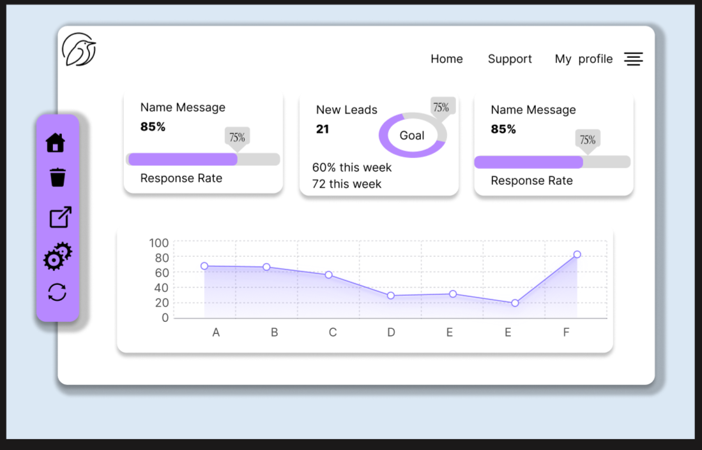
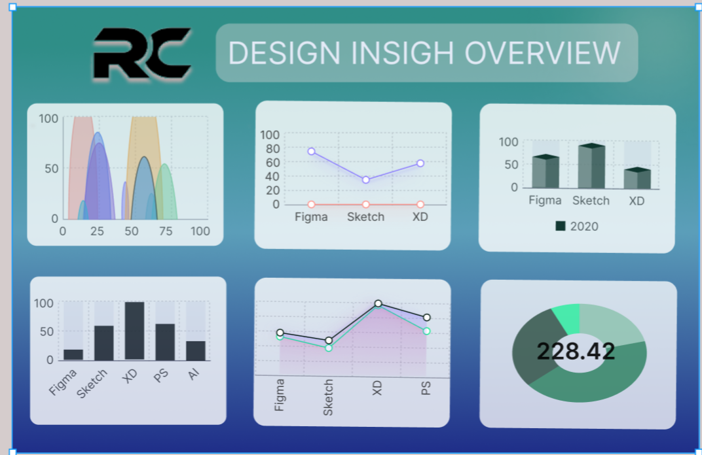

# My-Figma-Design-Portfolio
# Figma Design Portfolio

> A collection of UI/UX designs built in Figma — ranging from wireframes to full product interfaces.  
> Designed by **RC** | Tools used: Figma

---

## About

This repository showcases my Figma design journey — from early wireframe explorations to polished, production-ready UI screens. Each project covers a different domain: dashboards, product landing pages, and data analytics interfaces.

---

## Designs — Worst to Best

### 1. EV-B Electric Scooter — Landing Page ⭐ Best
> A product landing page for an electric scooter brand with live stats display.

- Live vehicle stats: Battery 60%, Range 125 KM, Load 100
- Speedometer gauge: 100 KM/hr
- Full product image with teal gradient background
- Navigation: Home, Products, Gallery, Contact, Login
- Pre-order CTA button
- Strong visual identity and brand feel

---

### 2. CRM Response Dashboard
> A clean, modern CRM dashboard with lead tracking and response rate analytics.

- Metric cards: response rate (85%), new leads (21), goal tracker
- Progress bars and donut goal chart
- Area line chart for performance over time (A–F)
- Purple + white colour scheme with left icon sidebar
- Soft, professional UI feel
---

### 3. Rxt Tech — Business Dashboard
> A full business analytics dashboard with revenue, expense, and client data.

- KPI cards: Total Revenue $40K, Expense $10K, Profit $30K
- Area charts for revenue and expense trends
- Bar chart: recent transactions
- Client table with name, service, and status
- Left sidebar navigation: Dashboard, Services, Customer, Report, Backup, Settings

---

### 4. Uber Dashboard
> A minimal analytics dashboard for ride tracking with key business metrics.

- KPI cards: 97K completed rides, 2.5M km distance, 84M revenue
- 3 donut charts: completed, cancelled, incomplete rides
- Vehicle type selector: auto, sedan, van, bike, tempo
- Clean black & white minimal aesthetic

---

### 5. Design Insight Overview (RC)
> A data insight dashboard comparing Figma, Sketch, XD, PS, and AI tool usage.

- 6-chart layout: area, line, bar, donut
- Multi-tool comparison across design software
- KPI number display (228.42)

---

### 6. RC Private Limited — Sales Dashboard
> A business sales dashboard with year-wise charts, filters, and customer table.

- Year-wise bar chart (2024, 2025, 2026)
- Sales vs profit ratio pie chart
- Customer-wise sales table
- Dropdown filters: Model, Year, Place, Categories

---

### 7. Spotify Wireframe
> Early-stage wireframe exploring layout structure for a Spotify-style music app.

- Tab navigation: Overview, Artists, Songs
- Grid-based card layout
- Status: skeleton / work in progress — no content added yet

---

## Skills Demonstrated

- Dashboard UI design
- Data visualisation layouts
- Product landing pages
- Wireframing and prototyping
- Navigation and sidebar patterns
- Chart and KPI card design

---

## Tools

- Figma
- Figma components & auto-layout
- FigJam (for wireframes)

---

## Contact

Feel free to connect or give feedback on any of these designs!

---

*Designed with passion. Growing every project.*
